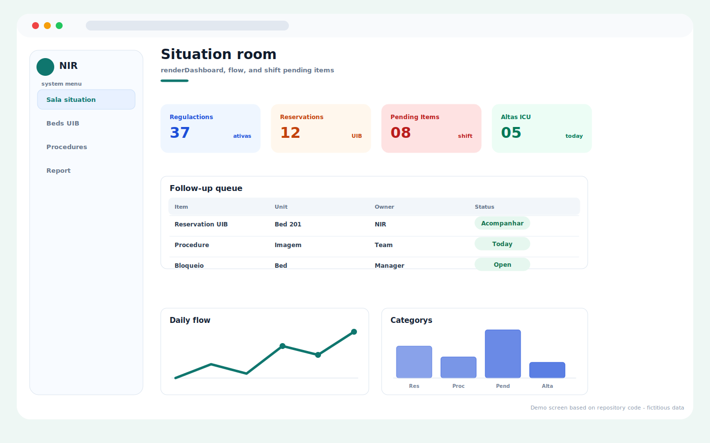
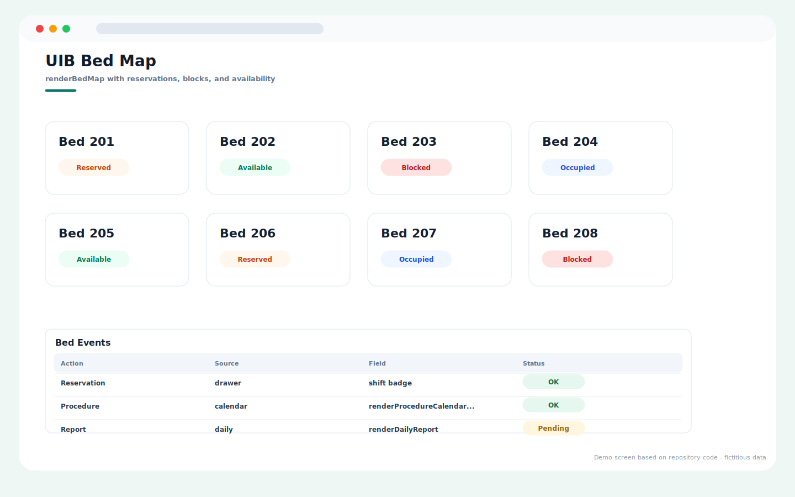
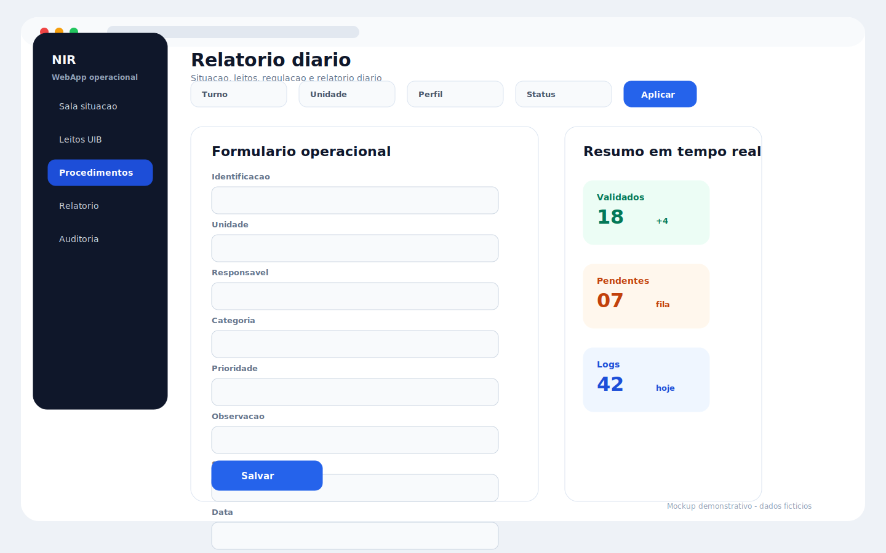

# NIR Shift Operations

Repository: `NIR`

## Overview

NIR operations app for situation-room monitoring, UIB bed map, procedures, flow tracking, and daily shift reports.

## Main Capabilities

- Situation room with regulations, reservations, pending items, and ICU discharge indicators.
- UIB bed map with reserved, available, blocked, and occupied states.
- Procedure calendar and daily report surfaces.
- Flow and audit tables for shift handoff.

## Operating Flow

1. Review the situation-room indicators at the start of the shift.
2. Inspect the bed map and update bed-related events.
3. Follow procedure calendar items during the day.
4. Save the daily report for shift continuity.

## Visual System Guide

> The screens below are documentation mockups based on the components, labels, colors, and workflows found in this repository. All displayed data is fictitious and does not represent real patients, staff members, or institutions.

### NIR - situation room

### NIR - bed map

### NIR - daily report

## Data Privacy

The repository documentation and guide images use fictitious sample data only.

## Technologies

- JavaScript
- HTML/CSS
- Google Apps Script
- Google Sheets

## Status

Completed
